# HIBIKI / Guardian-TRON

<p align="center">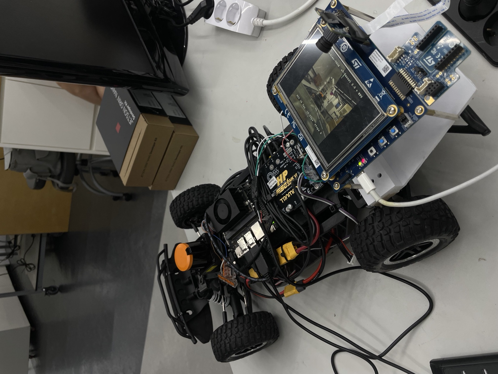</p>

**A μT-Kernel 3.0 safety co-processor that stops an autonomous car for a person 30 µs after its on-board NPU sees them, even when the AI computer is overloaded or has frozen.**

TRON Programming Contest 2026 — RTOS Application, Student division. Theme: *TRON × AI*.
Team (Yonsei University): Yun-sang Nam (system architecture), Min-jun Song (control / RTOS), Na-yeon Kwak (AI).

## Run it on the car

The car arrives fully wired: cable colours and pins are in [hw/wiring.md](hw/wiring.md). You need a laptop (Windows, macOS or Linux) and a Wi-Fi network for the Jetson. Keep the car on its stand, wheels off the ground, for the first run.

### 1. Laptop: install once

```bash
# macOS (Homebrew):   brew install python git
# Ubuntu / Debian:    sudo apt install -y python3 python3-venv git && sudo usermod -aG dialout $USER   (log out and in once)
# Windows 10/11:      winget install -e --id Python.Python.3.12 ; winget install -e --id Git.Git   (then reopen the terminal)

git clone https://github.com/gkgk0119gmail-arch/guardian-tron.git
cd guardian-tron
py -m venv .venv                 
.\.venv\Scripts\Activate.ps1             
pip install -r sw/requirements.txt     # pyserial, matplotlib, numpy
```

On Windows, write `python` instead of `python3` in the commands below. The same steps in PowerShell:

```powershell
git clone https://github.com/gkgk0119gmail-arch/guardian-tron.git
cd guardian-tron
py -m venv .venv
Set-ExecutionPolicy -Scope CurrentUser -ExecutionPolicy RemoteSigned   # once, if activate says "running scripts is disabled"
.venv\Scripts\Activate.ps1
pip install -r sw\requirements.txt
python sw\examples\hibiki_eval.py --list-ports       # the board shows up as "STMicroelectronics STLink Virtual COM Port (COMx)"
```

If the board's COM port does not show up, install the ST-LINK driver [STSW-LINK009](https://www.st.com/en/development-tools/stsw-link009.html) and replug the cable. `ssh` is built into Windows 10/11.

### 2. Power up

1. On the STM32 board, check the two BOOT switches: **BOOT0 left, BOOT1 left** (boot from flash, as shipped).
2. Plug your laptop's USB-C cable into the board's **ST-LINK USB-C** port. It powers the board and carries its console. If the car's 5 V converter cable is in that port, take it out first.
3. Connect the battery (XT60). The STM32's LCD shows the camera image after about 5 s. The Jetson needs about 1 min to boot.

### 3. Put the Jetson on your Wi-Fi and find its IP

With a monitor and a keyboard on the Jetson, log in as `orin` (the password is in the shipping note) and run:

```bash
nmcli device wifi connect "<your SSID>" password "<your Wi-Fi password>"
hostname -I          # e.g. "192.168.0.5 192.168.1.23 172.17.0.1"
```

Use the address that is neither `192.168.0.5` (the Jetson's private link to the LiDAR) nor `172.17.0.1` (Docker): here `192.168.1.23`. Your laptop must be on the same Wi-Fi.

### 4. Open two terminals on the laptop

Both terminals run **on your laptop**. Only terminal 2 logs into the Jetson with `ssh`.

```
 your laptop
 ┌──────────────────────────────────┐      USB-C cable
 │ Terminal 1                       │ ───────────────────▶ STM32 board
 │   python3 sw/examples/           │  (runs on the laptop, no ssh)
 │       hibiki_eval.py --watch     │
 ├──────────────────────────────────┤      Wi-Fi
 │ Terminal 2                       │ ───────────────────▶ Jetson
 │   ssh orin@<Jetson IP>           │  (only this one uses ssh)
 │   ~/guardian/hibiki.sh start …   │
 └──────────────────────────────────┘
```

#### Terminal 1 (on the laptop, not ssh): watch the STM32

```bash
python3 sw/examples/hibiki_eval.py --watch
```

It finds the board's console by itself (`--list-ports` shows the ports) and prints every safety event as it happens. Leave it running.

#### Terminal 2 (on the laptop, then ssh into the Jetson): drive the car

```bash
ssh orin@<Jetson IP>
~/guardian/hibiki.sh start 0.3         # ROS 2 stack: LiDAR, planner, command bridge to the STM32 (0.3 m/s)
~/guardian/hibiki.sh arm               # the wheels turn: every command now goes through the STM32
```

Now do the following, one at a time, and watch Terminal 1:

| Do | Terminal 1 shows |
|---|---|
| walk toward the camera from about 4 m | `[gate] SLOW: person ~300 cm ahead … speed cap …`, then `[gate] STOP #n: PERSON AHEAD … detect->gate 30 us`. The wheels stop; they turn again 1.5 s after you step away. A real person is needed: the model does not detect mannequins |
| press the blue **USER1** button on the STM32 board | `[gate] STOP: MPU blocked a write to gatekeeper memory by task 6`: the AI task tried to write safety memory, the MPU refused, the car stops for 3 s |
| lift the car or tilt it by more than 30° | `[gate] STOP: IMU TILT (-33 deg) … detect->gate 1 us` |
| in Terminal 2: `~/guardian/hibiki.sh stress 30`, then walk in front again | the same stops at the same ~30 µs while the Jetson's 6 cores run at 100 % |
| in Terminal 2: `~/guardian/hibiki.sh freeze` | `[fault] Jetson silent for 210 ms (watchdog 200 ms) -> safe state`, then `[fault] Jetson link restored …` |

Finish with:

```bash
~/guardian/hibiki.sh stop              # Terminal 2
```

Then press **Ctrl+C in Terminal 1**. It waits for the board's last metrics table and prints the PASS / FAIL table: context switch, interrupt latency, 100 Hz monitor jitter, NPU rate, person → brake, speed cap, IMU, MPU, watchdog and command checks. A copy is saved in `sw/examples/out/<date_time>/` with the raw console log.

`~/guardian/hibiki.sh status` shows what the Jetson's bridge sees (commands sent, approved, vetoed, round-trip time). `~/guardian/hibiki.sh start 0.5 gap` drives with the LiDAR gap follower instead of straight at constant speed.

### Without the car

Every run above was recorded (`sw/results/raw_logs/`). The same evaluator re-judges a recording, and the graphs in this README are redrawn from the same logs:

```bash
python3 sw/examples/hibiki_eval.py --offline sw/results/raw_logs/run_A_person_stress_freeze/stm32.log
python3 sw/examples/hibiki_eval.py --offline sw/results/raw_logs/run_D_mpu_imu_faults/stm32.log
python3 sw/results/make_figures.py
```

To rebuild and reflash the firmware (not needed for evaluation: the board is shipped flashed, and `sw/binaries/` holds the same images), see [sw/docs/setup_guide.md](sw/docs/setup_guide.md).

## How it works

A Jetson Orin Nano plans the path from a LiDAR (ROS 2 / F1TENTH stack), but it never touches the actuators.
Every drive command goes through an **STM32N6570-DK running μT-Kernel 3.0**. The STM32 alone decides whether the car may move:

| μT-Kernel task | pri | What it does | If it fails |
|---|---|---|---|
| `gate` | 8 | Checks every Jetson command (CRC, replay, steering/speed envelope) and drives the VESC motor controller. Brakes on any hazard | 200 ms without a valid command → brake |
| `imu` | 10 | 100 Hz cyclic safety monitor: IMU + Kalman filter → impact (> 2.5 g) and tilt (> 30°) hazards | — |
| `vision` | 20 | Camera → **YOLOX-nano on the Neural-ART NPU** (15 fps) → person in the corridor: slow down with distance, stop within 2 m | no frame for 500 ms → car held |
| `report` | 25 | Console reports: metrics table, CPU share, status line | a late report, nothing else |
| `log` | 30 | Non-blocking console output | drops, never blocks |

The NPU result reaches the brake through μT-Kernel preemption: the vision task raises the hazard, the gate task preempts it, and the brake command is issued **30 µs** later.
The Jetson is not in this loop. An MPU keeps the AI task from writing gatekeeper memory. A dispatcher hook measures every task switch.

## Inside the car

The car with the top deck removed. The LiDAR and the Jetson plan the path. The STM32N6570-DK running μT-Kernel 3.0 checks every drive command before anything reaches the VESC.


Bill of materials with quantities and evaluation needs: [hw/README.md](hw/README.md). Pins and baud rates: [hw/wiring.md](hw/wiring.md).

### Control signal path

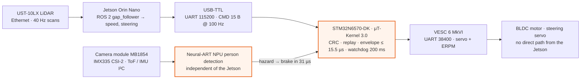

### Power path

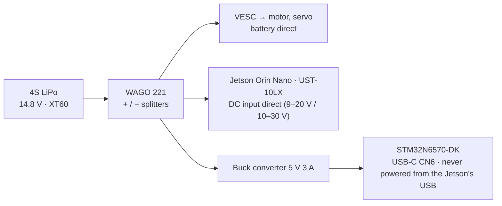

## Measured on the board (not targets)

| Metric | Design target | Measured (max, n) |
|---|---|---|
| Context switch (`tk_wup_tsk` → task running) | < 5.7 µs | **0.87 µs** (mean 0.44 µs, n = 2 000) |
| Hazard detected → brake issued | < 100 µs | **34 µs** (61 person stops: mean 30 µs; 5 IMU tilts: 1 µs; n = 66) |
| USART interrupt → gatekeeper task | < 50 µs | **9.5 µs** (p99 1.1 µs, n = 695 600) |
| Jetson command → verdict + actuation | < 1 ms | **13.4 µs** (p99 8.8 µs, n = 43 119) |
| 100 Hz monitor period jitter (NPU at full load) | 42 % below Linux | **11.9 µs** over 80 932 periods with the Jetson commanding at 100 Hz (p99 2.0 µs, 0 over 100 µs). Linux on the Jetson under load: 3.3–3.9 ms (**99.6 % lower**). See [Fixed issue](#fixed-issue-rare-monitor-jitter-spikes) |
| Jetson frozen → car in safe state | < 250 ms | **210 ms** (n = 7, watchdog 200 ms) |
| Camera frame → person decision | < 100 ms | 31.4 ms (NPU 28.5 ms) |
| CPU used by the safety tasks (gate + imu) | < 3 % | 3.2 % |

All numbers are printed by the firmware itself (DWT cycle counter, 1.25 ns resolution). How they were measured is in [sw/docs/test_report.md](sw/docs/test_report.md). Raw logs and CSV files are in [sw/results/](sw/results/). The graphs below are regenerated from those logs by [`sw/results/make_figures.py`](sw/results/make_figures.py).

### Graphs

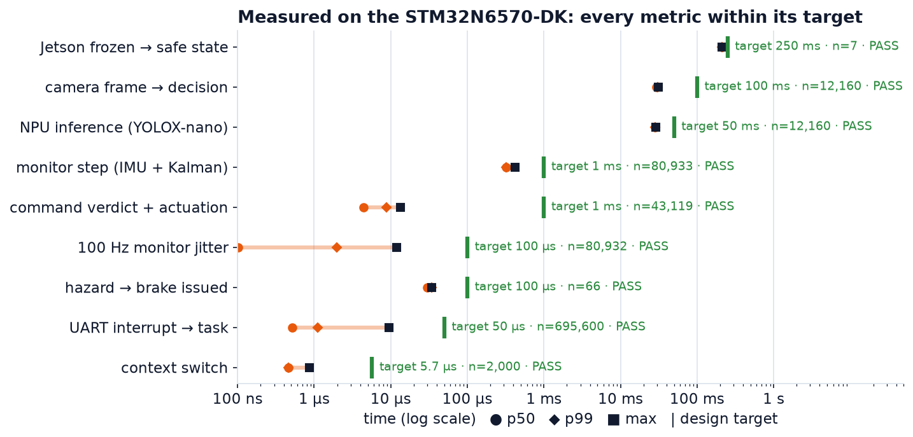

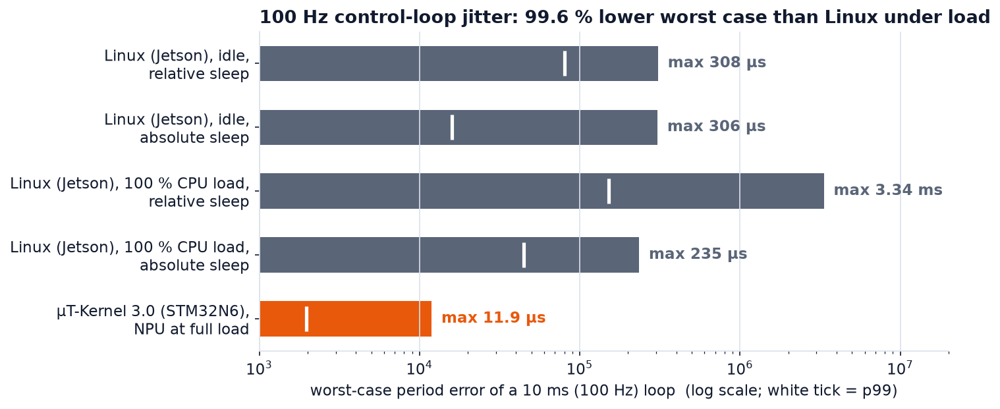

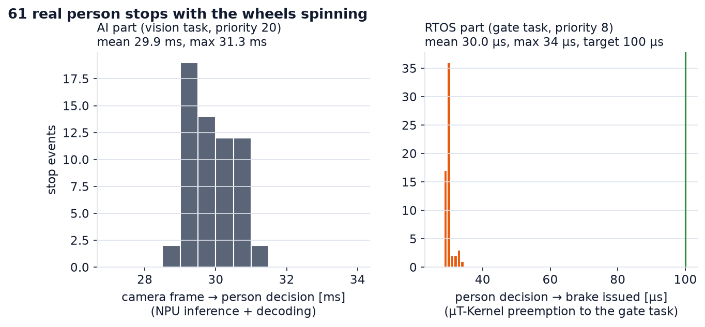

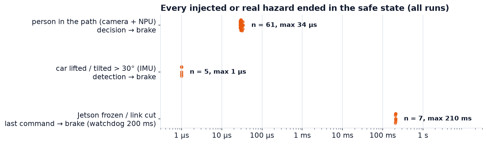

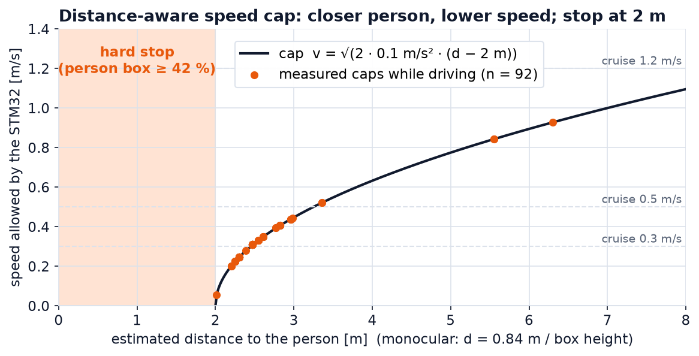

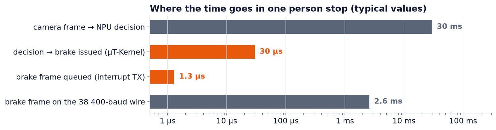

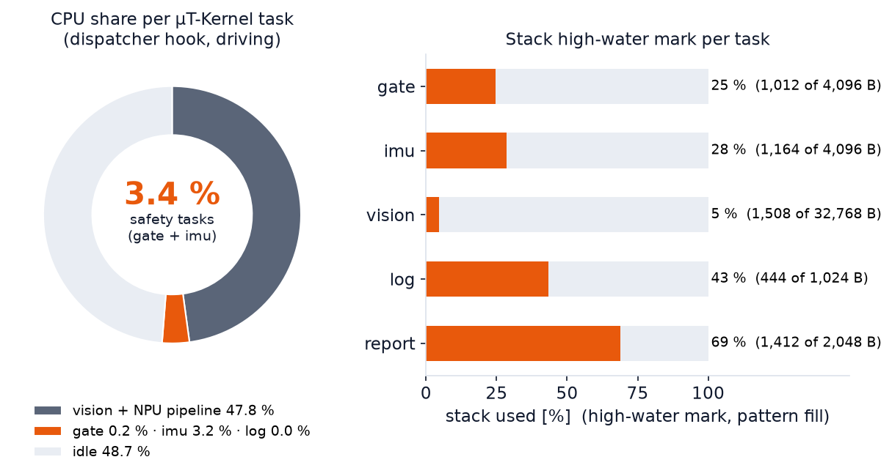

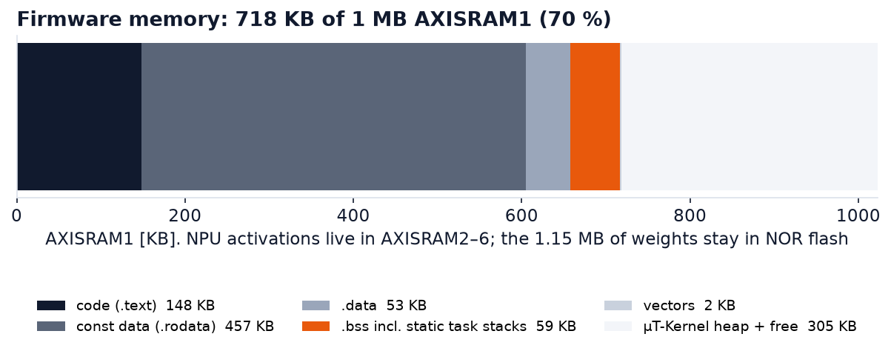

## Documents

| Document | For |
|---|---|
| [sw/docs/setup_guide.md](sw/docs/setup_guide.md) | Tools, versions, build, flashing, Jetson setup |
| [sw/docs/operation_procedure.md](sw/docs/operation_procedure.md) | Step-by-step power-up and run |
| [sw/docs/operation_manual.md](sw/docs/operation_manual.md) | What the system does, switches/buttons, what the LCD and the logs mean, errors and recovery |
| [sw/docs/evaluation_guide.md](sw/docs/evaluation_guide.md) | **What to run and what to check (with pass criteria)** |
| [hw/wiring.md](hw/wiring.md) | Wiring, pins, ports, baud rates |
| [hw/README.md](hw/README.md) | Bill of materials and photos |
| [sw/docs/test_report.md](sw/docs/test_report.md) | Measurement method and results |
| [sw/docs/third_party_software.md](sw/docs/third_party_software.md) | Third-party software, models, datasets and licenses |

## Fixed issue: rare monitor jitter spikes

The first long runs on the car (`sw/results/raw_logs/run_F…run_I`, 121 034 monitor periods) had 20 periods (0.017 %) that started 0.1–0.82 ms late, and a longest monitor step of 1.14 ms. No 10 ms deadline was missed. Cause: every 10 s the `gate` task (priority 8, above the `imu` monitor at 10) computed the percentile table and formatted the console report itself, a 0.5–0.8 ms burst. The reports now come from a separate `report` task at priority 25, below every safety task. With that firmware (`run_J`, and the flashed image in `sw/binaries/`): **0 of 80 932 periods over 100 µs, max 11.9 µs, longest step 422 µs**. The older logs are kept unchanged, so `hibiki_eval.py --offline` on `run_F…run_I` still shows the two FAIL lines.

## Repository layout

```
guardian-tron/
├── README.md                  this file
├── hw/                        hardware
│   ├── README.md              bill of materials (with photo)
│   ├── wiring.md              pins, ports, baud rates, power, board switches
│   └── photos/
└── sw/                        software
    ├── guardian_vision/       STM32 firmware (μT-Kernel 3.0 BSP2 + tasks + ST camera/NPU pipeline), Makefile project
    │   ├── os/                μT-Kernel side: usermain.c (task set), gv_task.c (vision), gv_imu.c (IMU + Kalman),
    │   │                      gv_mpu.c (MPU), gv_perf.c (dispatch hook, metrics), gv_log.c (logger), gv_i2c_lock.c
    │   ├── gt/                gatekeeper: gt_gate.c (task), gt_uart.c, gt_vesc.c, gatekeeper_core.c, safety_envelope.c, protocol.c
    │   ├── Src/, Inc/         ST camera + NPU pipeline adapted to run as a task
    │   └── mtk3_bsp2/         μT-Kernel 3.0 BSP2 (TRON Forum), 3 documented changes
    ├── jetson_stack/          Jetson side: ros2/ (gt_bridge, launch files), bench/ (Linux jitter probe), earlier SIL tools
    ├── examples/              hibiki_eval.py: judge every claim from a live board or a recorded log (start here)
    ├── requirements.txt       Python packages for the examples (pyserial, matplotlib, numpy)
    ├── tools/                 flash_boot.sh, load_vision.sh, pc_host.py (Jetson stand-in), nn_weights.sh
    ├── run_demo.sh            one-command demo on the car (--stress, --freeze fault injection)
    ├── binaries/              ready-to-flash images + SHA256SUMS
    ├── results/               raw logs, CSV and graphs of the measurements (make_figures.py redraws them)
    ├── docs/                  setup, operation, evaluation, test report, third-party list
    └── archive/               earlier bring-up projects (not needed to build)
```

## License

Our own code (`sw/guardian_vision/os`, `sw/guardian_vision/gt`, `sw/jetson_stack`, `sw/tools`, `sw/examples`, `sw/run_demo.sh`, `sw/docs`, `hw`) is released under the MIT License.
μT-Kernel 3.0 BSP2 is under the T-License 2.2 (TRON Forum). The camera/NPU pipeline files in `sw/guardian_vision/Src` are adapted from ST's object-detection application (SLA0044). STM32 HAL/BSP are BSD-3-Clause, CMSIS is Apache-2.0, and the ST model is SLA0044. See [sw/docs/third_party_software.md](sw/docs/third_party_software.md).
