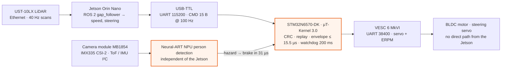
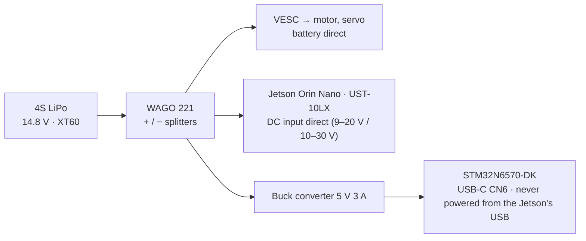

# HIBIKI / Guardian-TRON

<p align="center"></p>

**A μT-Kernel 3.0 safety co-processor that stops an autonomous car for a person 30 µs after its on-board NPU sees them, even when the AI computer is overloaded or has frozen.**

TRON Programming Contest 2026 — RTOS Application, Student division. Theme: *TRON × AI*.
Team (Yonsei University): Yun-sang Nam (system architecture), Min-jun Song (control / RTOS), Na-yeon Kwak (AI).

## Quick start for judges — step by step

You can check our results in three levels. Level 1 needs nothing but a PC; level 2 needs the board we ship; level 3 adds the USB-TTL cable from the kit.

| Level | Needs | Time | What you verify |
|---|---|---|---|
| **1. No hardware** | any PC with Python 3.8+ | 5 min | our recorded runs → the same PASS/FAIL table and graphs as in this README |
| **2. The board** | STM32N6570-DK (pre-flashed) + USB-C cable | 10 min | μT-Kernel boot, task set, timing metrics, person stop, MPU fault injection, IMU tilt stop |
| **3. Board + USB-TTL** | + 3.3 V USB-TTL on D0/D1/GND | +5 min | your PC plays the Jetson: command checks, watchdog, unsafe / replayed / corrupted commands |

### Step 1 — Install Python, Git and pyserial

**Windows 10/11** (PowerShell):

```powershell
winget install -e --id Python.Python.3.12
winget install -e --id Git.Git
# reopen PowerShell, then:
git clone https://github.com/gkgk0119gmail-arch/guardian-tron.git
cd guardian-tron
py -m venv .venv
.venv\Scripts\activate
pip install -r sw\requirements.txt
```

If the board's serial port does not appear in step 3, install the ST-LINK driver [STSW-LINK009](https://www.st.com/en/development-tools/stsw-link009.html) (it also comes with STM32CubeProgrammer).

**macOS** (Terminal, with [Homebrew](https://brew.sh)):

```bash
brew install python git
git clone https://github.com/gkgk0119gmail-arch/guardian-tron.git
cd guardian-tron
python3 -m venv .venv
source .venv/bin/activate
pip install -r sw/requirements.txt
```

**Ubuntu / Debian**:

```bash
sudo apt install -y python3 python3-venv git
sudo usermod -aG dialout $USER        # serial port access; log out and in once
git clone https://github.com/gkgk0119gmail-arch/guardian-tron.git
cd guardian-tron
python3 -m venv .venv
source .venv/bin/activate
pip install -r sw/requirements.txt
```

All commands below are run from the `guardian-tron` folder with the `.venv` active. On Windows write `python` instead of `python3` and `\` instead of `/` in paths.

### Step 2 — Level 1: reproduce our results without hardware

The firmware prints every measurement on its console. We recorded the console of every run (`sw/results/raw_logs/`). The evaluator reads such a log and judges each claim:

```bash
# the controlled run: person stops + Jetson at 100 % CPU + Jetson frozen for 1.5 s
python3 sw/examples/hibiki_eval.py --offline sw/results/raw_logs/run_A_person_stress_freeze/stm32.log

# fault injection on the car: MPU-blocked write, IMU tilt stop
python3 sw/examples/hibiki_eval.py --offline sw/results/raw_logs/run_D_mpu_imu_faults/stm32.log

# 1.2 m/s on the floor: the speed cap falls as a person approaches, then the stop
python3 sw/examples/hibiki_eval.py --offline sw/results/raw_logs/run_H_film_1p2/stm32.log

# redraw every graph in this README from the same logs
python3 sw/results/make_figures.py
```

Expected output of the first command (abridged):

```
  ID  Area     Check                                                   Result   Measured
  E2  RTOS     Context switch (tk_wup_tsk → task running)              PASS     n=2,000  p50 412 ns  p99 412 ns  max 878 ns  (target < 5.7 µs)
  E3  RTOS     UART interrupt → gatekeeper task                        PASS     n=72,257  p50 468 ns  p99 1.17 µs  max 6.08 µs  (target < 50 µs)
  E4  RTOS     100 Hz safety monitor period jitter (NPU at full load)  PASS     n=9,783  p50 138 ns  p99 2.34 µs  max 23.2 µs  (target < 100 µs)
  A3  AI→RTOS  Person ahead → brake issued (μT-Kernel preemption)      PASS     6 stops, decision → brake mean 30.2 µs, max 31 µs (target < 100 µs)
  F3  Fault    Jetson silent → safe state (watchdog)                   PASS     1 losses, max 210 ms (target < 250 ms)
  ...
  12 PASS   0 FAIL   5 not run   1 info
```

The floor runs (`run_F` … `run_I`) show two FAIL lines on purpose: see [Known issue](#known-issue-rare-monitor-jitter-spikes).

### Step 3 — Level 2: the board

1. Check the two BOOT switches on the board: **BOOT0 left, BOOT1 left** (boot from flash, as shipped).
2. Connect the **ST-LINK USB-C port** to your PC. The LCD shows the camera image after about 5 s.
3. Run the guided evaluation. It finds the ST-LINK console port by itself:

   ```bash
   python3 sw/examples/hibiki_eval.py --list-ports    # optional: shows the port it will use
   python3 sw/examples/hibiki_eval.py
   ```

4. The script collects the RTOS metrics for about 40 s, then asks you to do three things. Each waits up to 60 s. Press Enter to skip one.
   - **a)** walk into the camera view and stop within about 2 m. It must be a real person; the model does not detect mannequins.
   - **b)** press the blue **USER1** button. The AI task then tries to write gatekeeper memory, and the MPU must block it.
   - **c)** tilt the board by more than 30° for a moment.
5. You get the PASS / FAIL table. A copy is saved in `sw/examples/out/<date_time>/report.md`, next to the raw console log.

No output? Press the black **RESET** button once while the script is waiting. Any serial terminal works as well: 115200 baud, 8N1, on the ST-LINK port.

### Step 4 — Level 3: your PC plays the Jetson

Wire the 3.3 V USB-TTL adapter to the Arduino header. **Leave its 5 V pin unconnected.**

| USB-TTL | Board (Arduino header) |
|---|---|
| TXD | D0 (PF6, USART2 RX) |
| RXD | D1 (PD5, USART2 TX) |
| GND | GND |

```bash
python3 sw/examples/hibiki_eval.py --list-ports              # find the USB-TTL port
python3 sw/examples/hibiki_eval.py --host COM5               # Windows example
python3 sw/examples/hibiki_eval.py --host /dev/ttyUSB0       # Linux example (macOS: /dev/cu.usbserial-*)
```

The PC now sends the Jetson's 100 Hz drive commands (speed 0 by default, so nothing moves) and injects four faults, one after the other: 40° steering, replayed sequence numbers, corrupted frames and a 1.5 s silence. The table then also fills the command, watchdog and fault rows. The same scenarios can be run one by one with `sw/tools/pc_host.py --port <port> --scenario freeze|unsafe|replay|garbage`.

### Step 5 — Optional: rebuild and reflash the firmware

This is not needed to evaluate: the board is shipped flashed, and `sw/binaries/` holds the same images with SHA-256 sums. To build from source, see [sw/docs/setup_guide.md](sw/docs/setup_guide.md). In short, with STM32CubeIDE 2.1 or later and STM32CubeProgrammer 2.21 or later installed:

```bash
cd sw
git clone --depth 1 -b v2.3.1 https://github.com/STMicroelectronics/STM32N6-GettingStarted-ObjectDetection.git st_od_ref
cd guardian_vision && make -j8 && make sign       # -> build/guardian_sign.bin
```

Then flash it with STM32CubeProgrammer as described in the setup guide (BOOT1 right while flashing, then back left).

## How it works

A Jetson Orin Nano plans the path from a LiDAR (ROS 2 / F1TENTH stack), but it never touches the actuators.
Every drive command goes through an **STM32N6570-DK running μT-Kernel 3.0**. The STM32 alone decides whether the car may move:

| μT-Kernel task | pri | What it does | If it fails |
|---|---|---|---|
| `gate` | 8 | Checks every Jetson command (CRC, replay, steering/speed envelope) and drives the VESC motor controller. Brakes on any hazard | 200 ms without a valid command → brake |
| `imu` | 10 | 100 Hz cyclic safety monitor: IMU + Kalman filter → impact (> 2.5 g) and tilt (> 30°) hazards | — |
| `vision` | 20 | Camera → **YOLOX-nano on the Neural-ART NPU** (15 fps) → person in the corridor: slow down with distance, stop within 2 m | no frame for 500 ms → car held |
| `log` | 30 | Non-blocking console output | drops, never blocks |

The NPU result reaches the brake through μT-Kernel preemption: the vision task raises the hazard, the gate task preempts it, and the brake command is issued **30 µs** later.
The Jetson is not in this loop. An MPU keeps the AI task from writing gatekeeper memory. A dispatcher hook measures every task switch.

## Inside the car

The car with the top deck removed. The LiDAR and the Jetson plan the path. The STM32N6570-DK running μT-Kernel 3.0 checks every drive command before anything reaches the VESC.


Bill of materials with quantities and evaluation needs: [hw/README.md](hw/README.md). Pins and baud rates: [hw/wiring.md](hw/wiring.md).

### Control signal path



### Power path



<!-- TODO photos: demo GIF (person steps in -> car stops), STM32N6570-DK LCD close-up, desk evaluation kit -->

## Measured on the board (not targets)

| Metric | Design target | Measured (max, n) |
|---|---|---|
| Context switch (`tk_wup_tsk` → task running) | < 5.7 µs | **0.88 µs** (mean 0.42 µs, n = 2000) |
| Hazard detected → brake issued | < 100 µs | **34 µs** (person stops: mean 30.1 µs; IMU tilts: 1 µs; n = 62) |
| USART interrupt → gatekeeper task | < 50 µs | **6.1 µs** (p99 1.2 µs, n = 72 257) |
| Jetson command → verdict + actuation | < 1 ms | **15.5 µs** (p99 9.6 µs, n = 4 538) |
| 100 Hz monitor period jitter (NPU at full load, Jetson at 100 % CPU) | 42 % below Linux | **23 µs** in the controlled run (p99 2.3 µs, n = 9 783), 99.3 % below Linux under the same load (3.3–3.9 ms). Over all floor runs (n = 121 034): p99 4.7 µs, **max 817 µs**; see [Known issue](#known-issue-rare-monitor-jitter-spikes) |
| Jetson frozen → car in safe state | < 250 ms | **210 ms** (n = 7, watchdog 200 ms) |
| Camera frame → person decision | < 100 ms | 31.4 ms (NPU 28.5 ms) |
| CPU used by the safety tasks (gate + imu) | < 3 % | 3.4 % |

All numbers are printed by the firmware itself (DWT cycle counter, 1.25 ns resolution). How they were measured is in [sw/docs/test_report.md](sw/docs/test_report.md). Raw logs and CSV files are in [sw/results/](sw/results/). The graphs below are regenerated from those logs by [`sw/results/make_figures.py`](sw/results/make_figures.py).

### Graphs


## Documents

| Document | For |
|---|---|
| [sw/docs/setup_guide.md](sw/docs/setup_guide.md) | Tools, versions, build, flashing, Jetson setup |
| [sw/docs/operation_procedure.md](sw/docs/operation_procedure.md) | Step-by-step power-up and run |
| [sw/docs/operation_manual.md](sw/docs/operation_manual.md) | What the system does, switches/buttons, what the LCD and the logs mean, errors and recovery |
| [sw/docs/evaluation_guide.md](sw/docs/evaluation_guide.md) | **What to run and what to check (with pass criteria)** |
| [hw/wiring.md](hw/wiring.md) | Wiring, pins, ports, baud rates |
| [hw/README.md](hw/README.md) | Bill of materials and photos |
| [sw/docs/test_report.md](sw/docs/test_report.md) | Measurement method and results |
| [sw/docs/third_party_software.md](sw/docs/third_party_software.md) | Third-party software, models, datasets and licenses |

## Known issue: rare monitor jitter spikes

In the long floor runs recorded while filming (`sw/results/raw_logs/run_F…run_I`, 121 034 monitor periods), **20 periods (0.017 %)** started 0.1–0.82 ms late, and the longest monitor step took 1.14 ms (target 1 ms). The 10 ms deadline was never missed: the worst period was 10.82 ms from start to start, and every step finished long before the next release. The short controlled runs on the stand (`run_A…run_E`) show no such spike.

Most likely cause, found while writing the evaluator: every 10 s the `gate` task (priority 8, above the `imu` monitor at 10) computes the percentile table and formats about 12 console lines, which takes roughly 0.5–0.8 ms. When that burst coincides with a monitor release it delays the start, and when it lands inside a step it stretches the step. The fix is to move the report into a low-priority task. It is written but not yet re-measured, so the published numbers and binaries are still from the firmware described here.

## Repository layout

```
guardian-tron/
├── README.md                  this file
├── hw/                        hardware
│   ├── README.md              bill of materials (with photo)
│   ├── wiring.md              pins, ports, baud rates, power, board switches
│   └── photos/
└── sw/                        software
    ├── guardian_vision/       STM32 firmware (μT-Kernel 3.0 BSP2 + tasks + ST camera/NPU pipeline), Makefile project
    │   ├── os/                μT-Kernel side: usermain.c (task set), gv_task.c (vision), gv_imu.c (IMU + Kalman),
    │   │                      gv_mpu.c (MPU), gv_perf.c (dispatch hook, metrics), gv_log.c (logger), gv_i2c_lock.c
    │   ├── gt/                gatekeeper: gt_gate.c (task), gt_uart.c, gt_vesc.c, gatekeeper_core.c, safety_envelope.c, protocol.c
    │   ├── Src/, Inc/         ST camera + NPU pipeline adapted to run as a task
    │   └── mtk3_bsp2/         μT-Kernel 3.0 BSP2 (TRON Forum), 3 documented changes
    ├── jetson_stack/          Jetson side: ros2/ (gt_bridge, launch files), bench/ (Linux jitter probe), earlier SIL tools
    ├── examples/              hibiki_eval.py: judge every claim from a live board or a recorded log (start here)
    ├── requirements.txt       Python packages for the examples (pyserial, matplotlib, numpy)
    ├── tools/                 flash_boot.sh, load_vision.sh, pc_host.py (Jetson stand-in), nn_weights.sh
    ├── run_demo.sh            one-command demo on the car (--stress, --freeze fault injection)
    ├── binaries/              ready-to-flash images + SHA256SUMS
    ├── results/               raw logs, CSV and graphs of the measurements (make_figures.py redraws them)
    ├── docs/                  setup, operation, evaluation, test report, third-party list
    └── archive/               earlier bring-up projects (not needed to build)
```

## License

Our own code (`sw/guardian_vision/os`, `sw/guardian_vision/gt`, `sw/jetson_stack`, `sw/tools`, `sw/examples`, `sw/run_demo.sh`, `sw/docs`, `hw`) is released under the MIT License.
μT-Kernel 3.0 BSP2 is under the T-License 2.2 (TRON Forum). The camera/NPU pipeline files in `sw/guardian_vision/Src` are adapted from ST's object-detection application (SLA0044). STM32 HAL/BSP are BSD-3-Clause, CMSIS is Apache-2.0, and the ST model is SLA0044. See [sw/docs/third_party_software.md](sw/docs/third_party_software.md).
