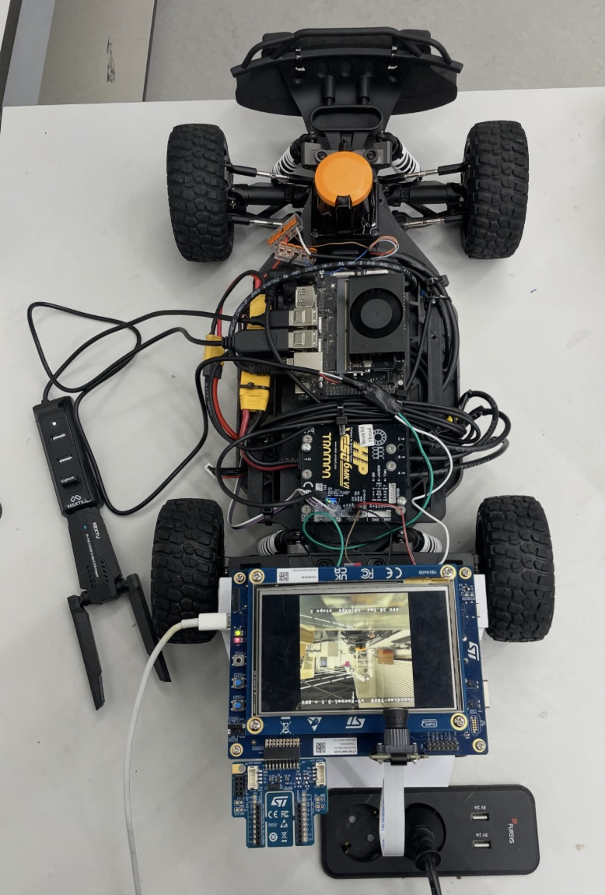
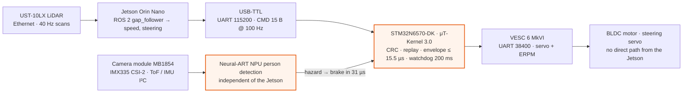
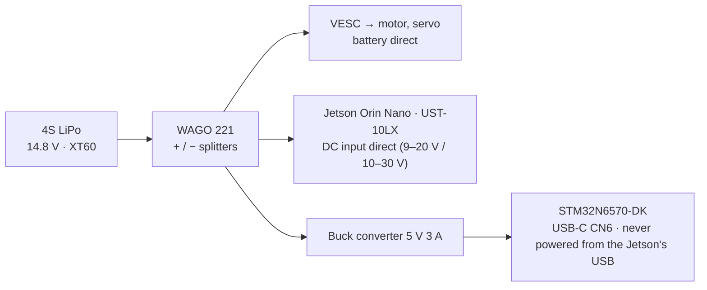

# HIBIKI / Guardian-TRON

**A μT-Kernel 3.0 safety co-processor that stops an autonomous car for a person 30 µs after its on-board NPU sees them, even when the AI computer is overloaded or has frozen.**

TRON Programming Contest 2026 — RTOS Application, Student division. Theme: *TRON × AI*.
Team (Yonsei University): Yun-sang Nam (system architecture), Min-jun Song (control / RTOS), Na-yeon Kwak (AI).

A Jetson Orin Nano plans the path from a LiDAR (ROS 2 / F1TENTH stack), but it never touches the actuators.
Every drive command goes through an **STM32N6570-DK running μT-Kernel 3.0**. The STM32 alone decides whether the car may move:

| μT-Kernel task | pri | What it does | If it fails |
|---|---|---|---|
| `gate` | 8 | Checks every Jetson command (CRC, replay, steering/speed envelope) and drives the VESC motor controller. Brakes on any hazard | 200 ms without a valid command → brake |
| `imu` | 10 | 100 Hz cyclic safety monitor: IMU + Kalman filter → impact (> 2.5 g) and tilt (> 30°) hazards | — |
| `vision` | 20 | Camera → **YOLOX-nano on the Neural-ART NPU** (15 fps) → person in the corridor: slow down with distance, stop within 2 m | no frame for 500 ms → car held |
| `log` | 30 | Non-blocking console output | drops, never blocks |

The NPU result reaches the brake through μT-Kernel preemption: the vision task raises the hazard, the gate task preempts it, and the brake command is issued **30 µs** later.
The Jetson is not in this loop. An MPU keeps the AI task from writing gatekeeper memory. A dispatcher hook measures every task switch.

## Inside the car

The car with the top deck removed. The LiDAR and the Jetson plan the path. The STM32N6570-DK running μT-Kernel 3.0 checks every drive command before anything reaches the VESC.

<p align="center"></p>

| # | Part | Role |
|---|---|---|
| 1 | Hokuyo UST-10LX 2D LiDAR | Jetson's main sensor: Ethernet 192.168.0.10, path planning and obstacle avoidance |
| 2 | Jetson Orin Nano | Main AI computer: ROS 2 Humble, gap_follower. **No direct connection to the actuators** |
| 3 | USB-TTL adapter (PL2303) | Jetson ↔ STM32 command link: UART 115200, 15-byte CMD / 12-byte VERDICT at 100 Hz |
| 4 | **STM32N6570-DK · μT-Kernel 3.0** | Safety gatekeeper: command envelope, 200 ms watchdog, NPU person stop, IMU monitor, MPU isolation. The LCD shows the camera |
| 5 | Camera module MB1854 | IMX335 5 MP + 8×8 ToF + IMU: the STM32's own perception, independent of the Jetson (CSI-2 / I²C) |
| 6 | VESC COMM harness | STM32 → VESC, UART 38400: red D5 → RX, brown A5 ← TX, black GND |
| 7 | VESC 6 MkVI HP | Motor controller: BLDC drive + steering servo output. **Only the STM32 can command it** |
| 8 | 1/10 4WD RC chassis | BLDC motor and steering servo under the deck. Wheelbase 0.32 m, steering capped at ±17.5° |
| 9 | 4S LiPo (XT60) | Main power, 14.8 V |
| 10 | WAGO 221 splitters | Battery +/− to the Jetson, LiDAR and 5 V converter |
| 11 | STM32 power, USB-C | 5 V into the ST-LINK port (CN6). On the car: 6–24 V → 5 V 3 A buck converter |
| 12 | USB hub + Wi-Fi adapter | SSH and monitoring of the Jetson only, not in the control path |
| 13 | STMod+ fan-out board | Comes with the DK; not used |

Full bill of materials with the numbered photo: [hw/README.md](hw/README.md). Pins and baud rates: [hw/wiring.md](hw/wiring.md).

### Control signal path



### Power path



<!-- TODO photos: demo GIF (person steps in -> car stops), STM32N6570-DK LCD close-up, desk evaluation kit -->

## Measured on the board (not targets)

| Metric | Design target | Measured (max, n) |
|---|---|---|
| Context switch (`tk_wup_tsk` → task running) | < 5.7 µs | **0.88 µs** (mean 0.42 µs, n = 2000) |
| Hazard detected → brake issued | < 100 µs | **31 µs** (mean 30.5 µs, n = 6) |
| USART interrupt → gatekeeper task | < 50 µs | **6.1 µs** (p99 1.2 µs, n = 72 257) |
| Jetson command → verdict + actuation | < 1 ms | **15.5 µs** (p99 9.6 µs, n = 4 538) |
| 100 Hz monitor period jitter (NPU at full load, Jetson at 100 % CPU) | 42 % below Linux | **23 µs**. Linux on the Jetson under the same load: up to 3.3–3.9 ms (≥ 99.3 % lower) |
| Jetson frozen → car in safe state | < 250 ms | **210 ms** (watchdog 200 ms) |
| Camera frame → person decision | < 100 ms | 31.4 ms (NPU 28.5 ms) |
| CPU used by the safety tasks (gate + imu) | < 3 % | 3.4 % |

All numbers are printed by the firmware itself (DWT cycle counter, 1.25 ns resolution). How they were measured is in [sw/docs/test_report.md](sw/docs/test_report.md). Raw logs and CSV files are in [sw/results/](sw/results/).

## Documents

| Document | For |
|---|---|
| [sw/docs/setup_guide.md](sw/docs/setup_guide.md) | Tools, versions, build, flashing, Jetson setup |
| [sw/docs/operation_procedure.md](sw/docs/operation_procedure.md) | Step-by-step power-up and run |
| [sw/docs/operation_manual.md](sw/docs/operation_manual.md) | What the system does, switches/buttons, what the LCD and the logs mean, errors and recovery |
| [sw/docs/evaluation_guide.md](sw/docs/evaluation_guide.md) | **What to run and what to check (with pass criteria)** |
| [hw/wiring.md](hw/wiring.md) | Wiring, pins, ports, baud rates |
| [hw/README.md](hw/README.md) | Bill of materials and photos |
| [sw/docs/test_report.md](sw/docs/test_report.md) | Measurement method and results |
| [sw/docs/third_party_software.md](sw/docs/third_party_software.md) | Third-party software, models, datasets and licenses |

## Shortest path to see it work

1. Board switches: BOOT0 left, BOOT1 left (boot from flash). Plug the ST-LINK USB-C port into a PC (it also powers the board).
2. Open the ST-LINK virtual COM port at 115200 8N1. The LCD shows the camera and the boot log shows `[rtos] task set …`.
3. Step in front of the camera: a box is drawn around the person and the log prints `[gate] STOP #n: PERSON AHEAD … detect->gate 30 us`.
4. Every 10 s the firmware prints the `[metric]` table with PASS/FAIL against the targets.

Without the Jetson, `sw/tools/pc_host.py` on any PC with a 3.3 V USB-TTL plays the Jetson (see the evaluation guide).

## Repository layout

```
guardian-tron/
├── README.md                  this file
├── hw/                        hardware
│   ├── README.md              bill of materials (with photo)
│   ├── wiring.md              pins, ports, baud rates, power, board switches
│   └── photos/
└── sw/                        software
    ├── guardian_vision/       STM32 firmware (μT-Kernel 3.0 BSP2 + tasks + ST camera/NPU pipeline), Makefile project
    │   ├── os/                μT-Kernel side: usermain.c (task set), gv_task.c (vision), gv_imu.c (IMU + Kalman),
    │   │                      gv_mpu.c (MPU), gv_perf.c (dispatch hook, metrics), gv_log.c (logger), gv_i2c_lock.c
    │   ├── gt/                gatekeeper: gt_gate.c (task), gt_uart.c, gt_vesc.c, gatekeeper_core.c, safety_envelope.c, protocol.c
    │   ├── Src/, Inc/         ST camera + NPU pipeline adapted to run as a task
    │   └── mtk3_bsp2/         μT-Kernel 3.0 BSP2 (TRON Forum), 3 documented changes
    ├── jetson_stack/          Jetson side: ros2/ (gt_bridge, launch files), bench/ (Linux jitter probe), earlier SIL tools
    ├── tools/                 flash_boot.sh, load_vision.sh, pc_host.py (Jetson stand-in), nn_weights.sh
    ├── run_demo.sh            one-command demo on the car (--stress, --freeze fault injection)
    ├── binaries/              ready-to-flash images + SHA256SUMS
    ├── results/               raw logs and CSV of the measurements
    ├── docs/                  setup, operation, evaluation, test report, third-party list
    └── archive/               earlier bring-up projects (not needed to build)
```

## Dependencies (quick version, details in [sw/docs/setup_guide.md](sw/docs/setup_guide.md))

| For | Install |
|---|---|
| Building the STM32 firmware | STM32CubeIDE 2.1.1 (for GNU Tools for STM32 14.3), GNU make, and the ST reference: `cd sw && git clone --depth 1 -b v2.3.1 https://github.com/STMicroelectronics/STM32N6-GettingStarted-ObjectDetection.git st_od_ref` |
| Flashing | STM32CubeProgrammer ≥ 2.21 (we used 2.22.0) |
| Running the evaluation from a PC | Python 3 + `pip install pyserial` (for `sw/tools/pc_host.py`), any serial terminal |
| The car (optional) | Jetson Orin Nano, JetPack 6, ROS 2 Humble, F1TENTH stack, pyserial. Copy `sw/jetson_stack/ros2/` to `~/guardian/` |

Build and flash:

```bash
cd sw/guardian_vision && make -j8 && make sign      # -> build/guardian_sign.bin
# BOOT1 right (development mode), then:
../tools/flash_boot.sh                              # FSBL + firmware to the NOR flash (macOS/Linux)
# BOOT0/BOOT1 left, power-cycle
```

## License

Our own code (`sw/guardian_vision/os`, `sw/guardian_vision/gt`, `sw/jetson_stack`, `sw/tools`, `sw/run_demo.sh`, `sw/docs`, `hw`) is released under the MIT License.
μT-Kernel 3.0 BSP2 is under the T-License 2.2 (TRON Forum). The camera/NPU pipeline files in `sw/guardian_vision/Src` are adapted from ST's object-detection application (SLA0044). STM32 HAL/BSP are BSD-3-Clause, CMSIS is Apache-2.0, and the ST model is SLA0044. See [sw/docs/third_party_software.md](sw/docs/third_party_software.md).
