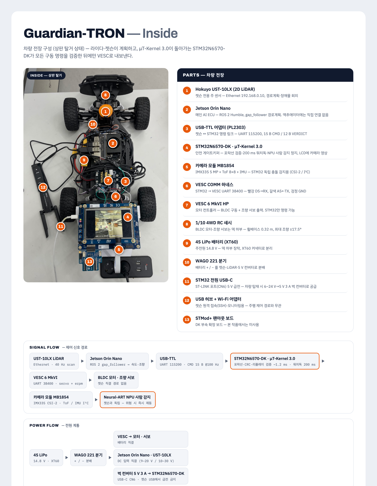
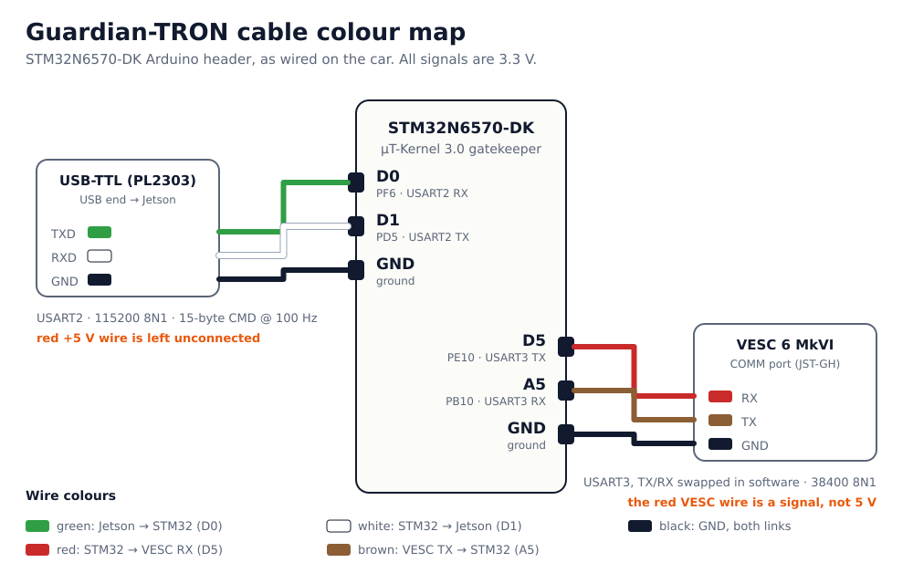
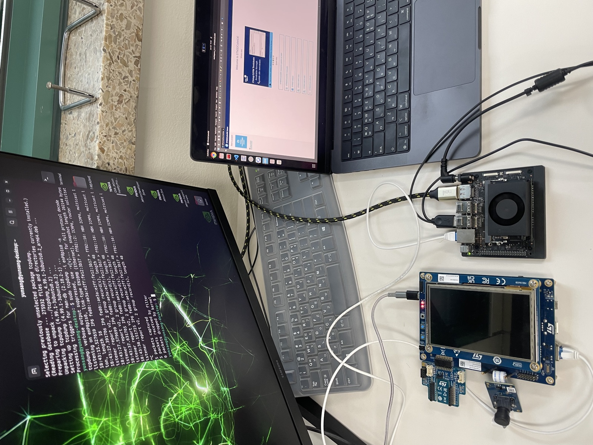
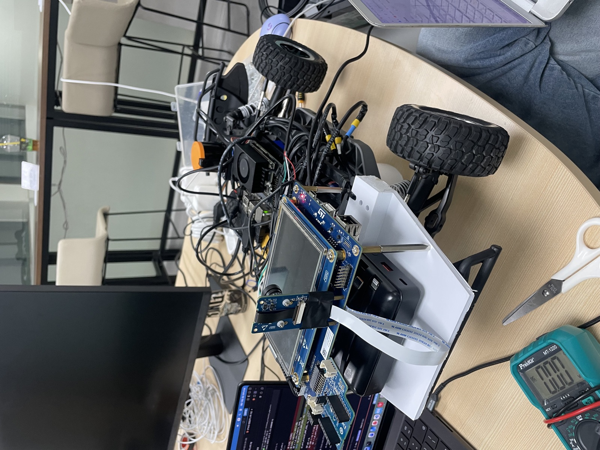

# Hardware

The Jetson plans the path, and the STM32N6570-DK running μT-Kernel 3.0 checks every drive command before it reaches the VESC. Wiring, pins and baud rates are in [wiring.md](wiring.md).

## Bill of materials

Numbers match the photo above.

| # | Part | Qty | Role in HIBIKI | Link / interface | Needed for evaluation |
|---|---|---|---|---|---|
| 4 | **STMicroelectronics STM32N6570-DK** | 1 | Safety gatekeeper on **μT-Kernel 3.0**: command envelope, 200 ms watchdog, NPU person stop, IMU monitor, MPU isolation; LCD shows the camera | — | **yes (core)** |
| 5 | Camera module MB1854 (IMX335 5 MP + VL53L5 8×8 ToF + IMU) | 1 | STM32-side perception, independent of the Jetson | CSI-2 FFC, I2C1 | **yes** |
| 3 | USB-TTL adapter PL2303, 3.3 V | 1 | Jetson ↔ STM32 command link (15-byte CMD / 12-byte VERDICT) | USART2, 115200 8N1, D0/D1 | yes (or any 3.3 V USB-TTL with `pc_host.py`) |
| 11 | USB-C cable / 5 V 3 A buck converter (6–24 V → 5 V) | 1 | STM32 power via the ST-LINK USB-C port (CN6) | 5 V | yes (USB-C cable on a desk) |
| 6 | VESC COMM harness (JST-GH) | 1 | STM32 → VESC: red D5 → RX, brown A5 ← TX, black GND | USART3, 38400 | car only |
| 7 | VESC 6 MkVI HP | 1 | Motor controller: BLDC drive + steering servo. Only the STM32 commands it | UART 38400 | car only |
| 2 | NVIDIA Jetson Orin Nano | 1 | Main AI computer: ROS 2 Humble, gap_follower path planning. No direct path to the actuators | USB-TTL | car only |
| 1 | Hokuyo UST-10LX 2D LiDAR | 1 | Jetson's main sensor (40 Hz scans) | Ethernet 192.168.0.10 | car only |
| 8 | 1/10 4WD RC chassis (BLDC motor, steering servo) | 1 | Vehicle: wheelbase 0.32 m, steering capped at ±17.5° by the STM32 | — | car only |
| 9 | 4S LiPo battery 14.8 V, XT60 | 1 | Main power | XT60 | car only |
| 10 | WAGO 221 splice connectors | 2 | Battery +/− to the Jetson, LiDAR and 5 V converter | — | car only |
| 12 | USB hub + Wi-Fi adapter | 1 | SSH / monitoring of the Jetson (not in the control path) | USB | no |
| 13 | STMod+ fan-out board | 1 | Comes with the DK; not used | — | no |

Not used (tried and dropped): Hokuyo UST-10LN obstacle sensor, BME280 environment sensor, STL-27L LiDAR, microSD logging.

## Cable colour map

Pin-by-pin tables, baud rates and the board switches: [wiring.md](wiring.md).

## Photos

| | |
|---|---|
|  |  |
| Bench bring-up: the DK and its MB1854 camera on the left, the Jetson Orin Nano on the right, joined by the USART2 command link. | On the car: the DK sits on the front deck with the camera facing forward, the Jetson and the VESC harness behind it. |
