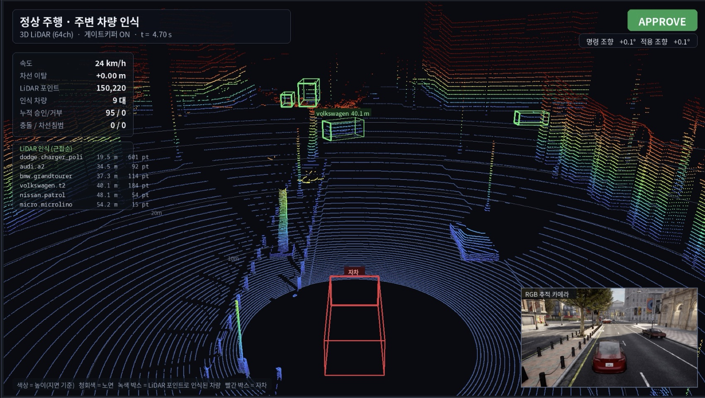
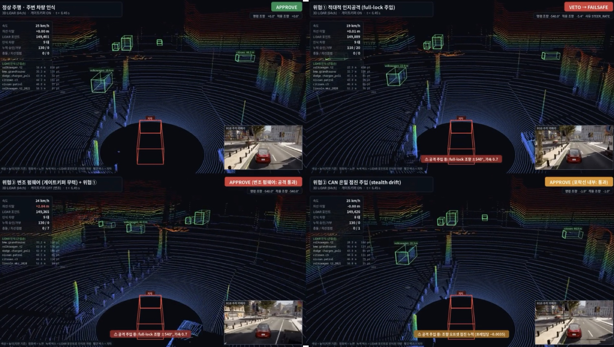
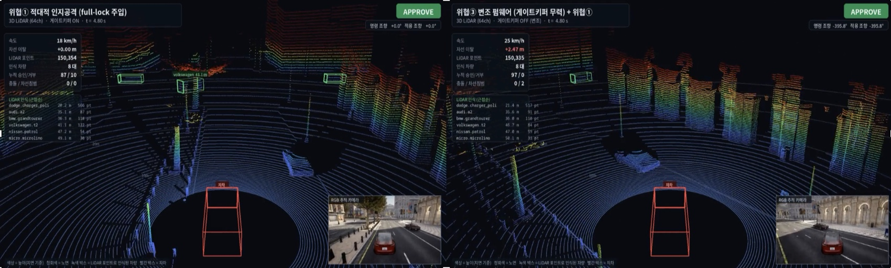

# The gatekeeper in CARLA, before it went on the car

Before there was a board, we drove the gatekeeper in [CARLA](https://carla.org/): a
simulated car with a 64-channel LiDAR, the same 15-byte CMD frames at 100 Hz, and an
attacker injecting steering commands into the link. The point was to answer one question
without risking a real vehicle — **does this veto logic actually stop an attack, and what
happens when it is not there?**

The simulator proved the *decision*. The board later proved the *timing*: the same logic
running on μT-Kernel 3.0 on the STM32N6570-DK, measured with the DWT cycle counter at
1.25 ns resolution ([test report](../../docs/test_report.md)).

## Reading the screenshots

The HUD was built in Korean while we worked. What the labels mean:

| Label | Meaning |
|---|---|
| 게이트키퍼 ON / OFF | gatekeeper enabled / disabled |
| 명령 조향 → 적용 조향 | steering **commanded** by the AI → steering **applied** after the gatekeeper |
| 누적 승인 / 거부 | cumulative APPROVED / VETOed commands |
| 충돌 / 차선침범 | collisions / lane violations |
| 차선 이탈 | lateral offset from the lane centre |
| 사유 STEER_RATE | veto reason: the steering rate limit |
| 녹색 박스 / 빨간 박스 | vehicle detected in the point cloud / ego vehicle |

## Normal driving

Gatekeeper ON, no attack. 95 commands approved, 0 vetoed, 0 collisions, 0 lane violations,
commanded steering +0.1° passed through as +0.1°. The gatekeeper is invisible when nothing
is wrong — that was the first thing we wanted to confirm, because a safety layer that
interferes with normal driving does not get deployed.

## Three threats, with and without the gatekeeper

All four panels are the same scenario at the same instant, t = 6.45 s:

| Case | Gatekeeper | Commanded → applied | Result |
|---|---|---|---|
| Normal driving | ON | +0.0° → +0.0° | APPROVE · 130/0 · **0 collisions, 0 lane violations** |
| **Threat ① adversarial perception** (full-lock injection) | ON | **−540.0° → −5.4°** | **VETO → FAILSAFE**, reason `STEER_RATE` · 110/20 · **0 collisions, 0 lane violations** |
| **Threat ③ tampered firmware** (gatekeeper disabled) + ① | OFF | −540.0° → **−540.0°** | attack passes · lateral offset **+2.84 m** · **7 lane violations** |
| **Threat ② CAN stealth drift** (slow offset accumulation) | ON | −1.0° → −1.0° | APPROVE — **inside the envelope** · lateral offset −0.80 m · 1 lane violation |

The first two rows are the result we were after: a full-lock steering injection of −540° is
clamped to −5.4° by the rate limiter and the car stays in its lane, while the identical
attack against a car whose gatekeeper has been disabled produces 7 lane violations within
the same few seconds.

The last row is the honest one. Threat ② does not jam the steering; it adds about −0.0035°
per frame, so every single command is legal and the gatekeeper approves all of them. The
car drifts anyway. A command-envelope check cannot catch an attack that stays inside the
envelope — this is the limitation that pushed us to give the STM32 **its own sensors**, so
that the final version on the car does not depend only on judging the commands it is sent.
The camera + NPU person stop and the IMU tilt monitor in the shipped firmware both came out
of this.

## What carried over to the board

This is the part that makes it sim-to-real rather than two separate projects:

| | In CARLA | On the STM32N6570-DK |
|---|---|---|
| `gatekeeper_core.c` | the veto state machine | **byte-identical** ([`sw/guardian_vision/gt/`](../../guardian_vision/gt/)) |
| `protocol.c` | 15-byte CMD / 12-byte VERDICT, CRC8, sequence | **byte-identical** |
| `safety_envelope.c` | generic limits (±540°, rate limit 10°/frame) | same code path, **retuned to this car**: `GK_STEER_ABS_LIMIT_DEG 17.5f`, `GK_STEER_RATE_LIMIT_DEG 3.0f` (300 °/s) |
| Timing | not meaningful — a simulator loop | DWT cycle counter: command verdict **13.4 µs** max over 43 119 commands |
| Scheduling | one Linux process | 5 μT-Kernel tasks at fixed priorities, preemptive |
| Hazard source | injected by the threat scripts | real: camera + NPU, IMU, link watchdog |

The `STEER_RATE` veto in the second panel above is the same check that runs on the board
today; only the constant changed, because the car's steering is mechanically limited to
±17.5°.

## Limitations of this page

- The CARLA integration itself (the simulator client, the LiDAR rendering and the HUD) is
  **not in this repository**. It was built for earlier work and is not needed to build,
  flash or evaluate the firmware. What is here is the gatekeeper logic it drove
  ([`../../jetson_stack/gatekeeper/`](../gatekeeper/)) and the threat scripts
  ([`../../jetson_stack/jetson/threats/`](../jetson/threats/)).
- The counters in the screenshots are from those simulator runs. **No number in the
  contest results comes from CARLA** — every measurement in the
  [README](../../../README.md) and the [test report](../../docs/test_report.md) was taken
  on the real board.
- The HUD text is Korean; the table at the top of this page is the translation.
